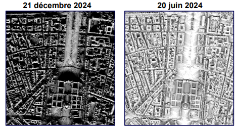

.. _sunmap_gen:

==================
Sun Map Generation
==================

From a Digital Surface Model of your area of interest, a range of dates and a time range per date of your choice, this tool
generates a “sun map” per date with the percentage of sun exposure over the time range, as well as a vector file that gives the
transition times from shade to sun (and sun to shade) for each pixel at the first date. Shadow masks can also be produced at each
step.

Remark : time range is given in the local time of the area of interest.

If the area of interest is important, the DSM should be divided into tiles beforehand (typically 1km*1km). The list of tiles is
given as input. The tool will manage the shadow impact on adjacent tiles.

Method :

- Compute elevation and azimuth angles of the Sun at the center of each tile for each time step in the time range and date range.

- Compute the corresponding shadow masks.

- Generate the “sun map” at each date.

- Generate the sun<>shade transitions vector file.

# ADD ILLUSTRATION AND DESCRIPTION OF ILLUSTRATION

Dire à l'utilisateur qu'il faut que son shapefile s'appelle TILE_NAME

#Change installation procedure
#TO DO

Installing environment
======================

To install SunMapGeneration, please launch the following commands :

.. code-block:: console

    conda create -n sunmap_env python=3.10 libgdal=3.5.0 -c conda-forge -c defaults -y
    conda activate sunmap_env
    pip install georastertools --no-binary rasterio
    pip install eolabtools[SunMapGen] --force-reinstall --no-cache-dir

Content
=======

- `/src` : Contains the main python file `SunMapGenerator.py`.

Run the tool
============

To launch the tool, please use the following command line script :

Input data
==========

    python SunMapGenerator.py --digital_surface_model /path_to_input_files/input_files.lst\
                              --date 2024-07-20 2024-07-30 3 \
                              --time 10:00 14:00 30 \
                              --nb_cores 32 \
                              --occ_changes 4 \
                              --output_dir /path_to_output_directory/output_directory/ \
                              --save_temp \
                              --save_masks

- `digital_surface_model` : path to the `.lst` file
- `date` : Date or date range (YYYY-MM-DD) and step (in days). The default step value is 1 day.
- `time` : Time or time range (HH:MM) and step (in minutes). The default step value is 30 minutes.
- `occ_changes` : Limit of sun/shade change of a pixel over one day. Even number (2 or 4). Default value 4.
- `nb_cores` : To launch parallel processing. Number of processes to be entered.
- `output_dir` : Path to the output directory
- `save_temp` : To be filled in to obtain the file describing the calculation time per step in the processing chain (`processing_time.csv`).
- `save_masks` : To save shadow masks calculated at each time step

Output files
============

Files are stored in the `output_dir` directory :

- **Shadow masks** : _[tile_name]-hillshade-[YYYYMMDD]-[HHMM].tif_ The algorithm calculates them for each tile, day and time entered by the user.

- **Percentage of sun exposure raster** : _[tile_name]-sun_map-[YYYYMMDD].tif_ The algorithm calculates them for each tile and each day entered by the user.

- **Sun appearance/disappearance vector** : _[tile user can choose the number of times a pixel will be exposed to sun/shade in a given day (`occ_changes`).

QGIS processing
===============

You can do “requests” on the sun_times gpkg file. For instance, if you want to detect places that are shadowed between 12h00 and 14h00, you can view the file on QGIS and filter it with the following expression :

.. code-block:: console

    "first_shadow_appearance" < '2024-08-31 11:55:00' AND "second_sun_appearance"  > '2024-08-31 14:05:00' OR "second_shadow_appearance"  < '2024-08-31 11:55:00'

