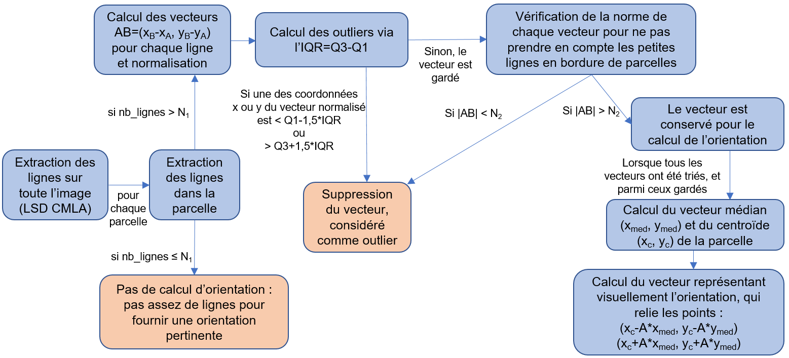

# Calcul de l'orientation des cultures

L'orientation des cultures est une thématique commune à différents projets. L'idée est de calculer pour chaque parcelle d'intérêt le vecteur d'orientation de la culture.


## Calcul des données utilisées dans le calcul des orientations

Il faut en premier lieu récupérer les informations issues du MNT pour récupérer la pente moyenne et l'orientation moyenne de la pente sur chaque parcelle.
Cette étape se fait à l'aide du script `generate_slope_aspect.sh` et se divise en plusieurs sous-tâches :

Pour créer le MNT monolithique pour un département donnée (ici le 11 : l'Aude), utiliser la commande `gdalbuildvrt` :

```
gdalbuildvrt -a_srs EPSG:2154 RGE_ALTI_11_5m.vrt /work/datalake/static_aux/MNT/RGEALTI_5M_France/1_DONNEES_LIVRAISON_2020-04-00197/RGEALTI_MNT_5M_ASC_LAMB93_IGN69_D011/*.asc
```

On peut ensuite calculer l'angle de la pente ainsi que l'orientation de la pente dans deux rasters avec `gdaldem` :

```
# gdaldem slope : donne sur chaque pixel la valeur de la pente du MNT en degrés
gdaldem slope of GTiff RGE_ALTI_11_5m.vrt  RGE_ALTI_11_5m_SLOPE.tif

# gdaldem aspect: donne sur chaque pixel la valeur de l'orientation la pente du MNT en angle azimut (Nord = 0°, Est = 90°, Sud = 180°, Ouest = 270 °).
gdaldem aspect of GTiff RGE_ALTI_11_5m.vrt  RGE_ALTI_11_5m_ASPECT.tif
```
Ces rasters seront utilisés dans le traitement final calculant l'orientation des parcelles.


## Fichiers de code contenus dans le répertoire

- `detection_orientation_culture/orientation_detection.py`: code pour détecter l'orientation des cultures à l'aide de l'algorithme de détection de segment fld.
- `detection_orientation_culture/detect_orientation_qsub.sh` : script qsub permettant de lancer un job sur le cluster pour le calcul de la détection des orientations à l'aide de fld.


# En utilisant les scripts qsub :

## Détection de l'orientation des cultures avec fld

Pour obtenir l'orientation des cultures dans un fichier shapefile, il faut utiliser le script `detect_orientation_qsub.sh`.
La méthode implémentée est celle utilisant celle utilisant la librairie fld issue d'openCV.


```
 python orientation_detection.py --img /work/EOLAB/DATA/BD_ORTHO/Gers/2019/ \
                                 --type jp2 \
                                 --rpg /work/EOLAB/USERS/duthoit/ORIENTATION_DES_CULTURES/RPGs/Gers/RPG_2vines_bis.shp \
                                 --output_dir /work/EOLAB/USERS/duthoit/Nettoyage/outputs \
                                 --nb_cores 4 \
                                 --patch_size 10000 \
                                 --slope /work/EOLAB/DATA/BD_ORTHO/Gers/RGE_ALTI_32_5m_SLOPE.tif \
                                 --aspect /work/EOLAB/DATA/BD_ORTHO/Gers/RGE_ALTI_32_5m_ASPECT.tif \
                                 --save_fld \
                                 --verbose
```

- Le code s'appuie sur l'algorithme ```fld``` pour détecter les segments dans les images à partir desquels sont calculées les orientations de chacune des parcelles du RPG en entrée.

- Pour exécuter le code en parallèle, choisir ```--nb_cores```>1. 

- Si la ou les images en entrée sont de grandes tailles, il est conseillé de définir une ```--patch_size``` qui sera utilisée pour réaliser un traitement par patch (plus rapide grâce à la parallélisation).

- Les fichiers ```--slope``` et ```--aspect``` doivent être générés au préalable (cf. *Calcul des données utilisées dans le calcul des orientations*) et fournis en entrée.


## Etapes de l'algorithme

Une fois les lignes détectées dans l'image (via pylsd ou fld), différents traitements sont appliqués sur les lignes afin de calculer l'orientation globale de la culture pour chaque parcelle.

Voici les grandes étapes de l'algorithme :


Pour chaque parcelle :

1. On récupère les lignes qui correspondent à la parcelle ;
2. Si le **nombre de lignes contenues dans une parcelle est inférieur à un nombre donné** (pour le moment fixé à 40), on ne sait pas donner l'orientation de la parcelle (trop incertaine) et on passe à la parcelle suivante. Sinon, on continue de travailler dans la parcelle actuelle :
3. Une ligne = un trait entre un point A=(xa, ya) et B=(xb,yb). Pour chaque ligne on calcule le vecteur AB = (xb-xa, yb-ya) qu'on normalise.
4. Une fois qu'on a toutes les coordonnées des vecteurs normalisés de la parcelle, on souhaite supprimer les outliers. On utilise pour cela l'indicateur **IQR = Q3 - Q1**, avec Q1 = 1er quartile et Q3 = 3ème quartile. La règle "standard" qui définie les outliers est la suivante : **les valeurs en dessous de Q1-1.5\*IQR ou au-dessus et Q3+1.5\*IQR sont considérées comme des outliers**. Si un vecteur normalisé possède une coordonnée en x ou en y identifiée comme outlier, il est supprimé de la liste des vecteurs.
5. La **norme des vecteurs restants est ensuite vérifiée : si elle est inférieure à un seuil donné (fixé ici à 8 pour la vigne), on ne prend pas en compte le vecteur**. On s'affranchit ainsi des petites lignes qui sont en bordure de parcelle et qui perturbent l'orientation globale.
6. Une fois tous les vecteurs de la parcelle triés, on fait la médiane des déplacements ce qui nous donne (xmed, ymed).
7. On calcule le centroide de la parcelle (xc, yc).
8. Le segment qui représente visuellement l'orientation de la vigne est centré sur le centroide et relie les points (xc-xmed, yc-ymed) et (xc+xmed, yc+ymed). Pour plus de visibilité (segments plus grands), un facteur A assez conséquent a été rajouté : (xc-A * xmed, yc-A * ymed) et (xc+A * xmed, yc+A * ymed).

On peut représenter ces différentes étapes sous forme de schéma :




De plus pour chaque orientation calculée, 4 colonnes d'indicateurs de qualité sur l'orientation calculée ont été ajoutées :

- "NB_LINES" qui totalise le nombre de lignes détectées prises en compte dans le calcul de l'orientation (plus on a de lignes et plus l'orientation calculée est fiable) ;
- "MEAN_LINES" qui donne la longueur moyenne des lignes prises en compte (plus les lignes sont longues et plus on a de chances qu'elles soient pertinentes dans le calcul de l'orientation).
- Les colonnes "STD_X_COOR" et "STD_Y_COOR" qui donnent l'écart-type des coordonnées en x et en y des lignes normalisées.

A partir des rasters Aspect et Slope calculés auparavent on peut extraire la valeur moyenne des pixels de ces éléments pour chaque parcelle. Ces valeurs moyennes ont été ajoutées dans des colonnes du shapefile :
- "SLOPE" qui indique l'angle moyen de la pente en degrés ;
- "ASPECT" qui indique l'orientation moyenne de la pente en degrés (angle azimut).
- "CALC_ASPECT" qui est la conversion en angle azimut du vecteur calculé de l'orientation des cultures, afin d epouvoir comparer l'orientation de la pente avec celle des cultures.

Enfin une colonne "INDIC_ORIE" a été ajoutée ; il s'agit d'un indicatur d'orientation allant de 0 à 90. 0=les rangées des cultures sont dans le sens de la pente ; 90=les orientations sont perpendiculaires.


